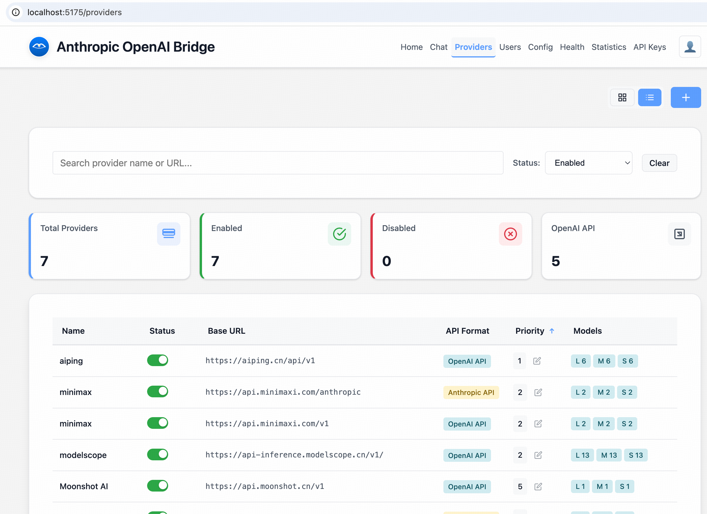
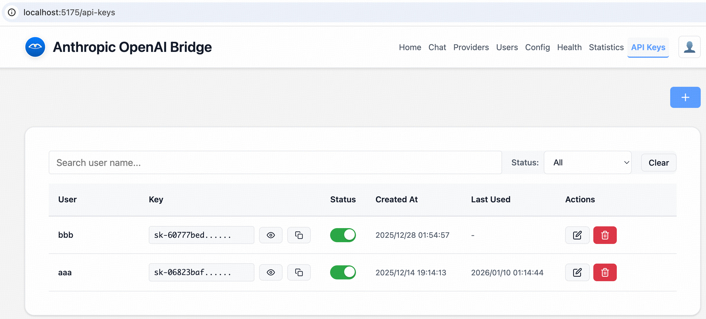
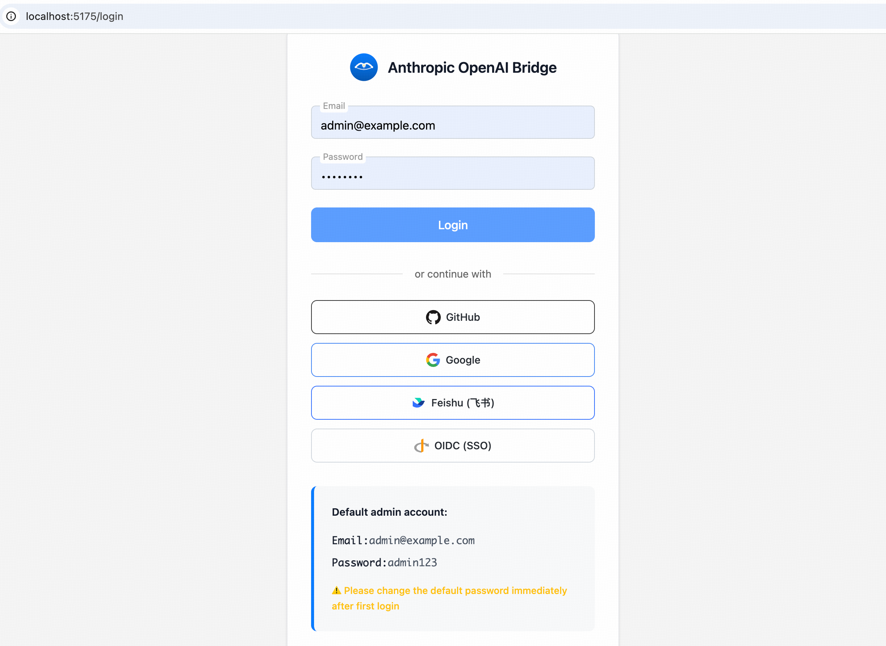

# Anthropic OpenAI Bridge

[](https://github.com/michaelhuang7119/anthropic-openai-bridge/actions)
[](https://opensource.org/licenses/MIT)
[](https://www.python.org/downloads/)
[](https://fastapi.tiangolo.com/)
[](https://svelte.dev/)

> 🌐 **中文文档** | [中文快速指南](./README-zh.md) • [中文技术文档](./docs/README-COMPLETE-zh.md)

A high-performance AI model proxy service based on FastAPI and Svelte 5, supporting multi-provider configuration and management.

## ✨ Project Introduction

Anthropic OpenAI Bridge is an enterprise-grade API proxy service that implements Anthropic-compatible API endpoints and forwards requests to backend providers supporting OpenAI-compatible interfaces (such as Qwen, ModelScope, AI Ping, Anthropic, etc.). Through a unified API interface, you can easily switch between different AI model providers without modifying client code.

## 🏗️ Project Architecture

### Backend Structure (FastAPI + Python 3.11+)

```
backend/app/
├── main.py                    # Application entry point
├── config/                    # Configuration management
│   ├── settings.py            # Main config (ProviderConfig, AppConfig, etc.)
│   └── hot_reload.py          # Config hot-reload with watchdog
├── core/                      # Core business logic
│   ├── auth.py                # JWT auth, API key validation
│   ├── constants.py           # Constants (API_VERSION, MAX_MESSAGE_LENGTH, etc.)
│   ├── lifecycle.py           # Startup/shutdown events
│   ├── model_manager.py       # Provider & model routing
│   ├── models.py              # Pydantic models (Message, MessagesRequest, etc.)
│   └── permissions.py         # Permission definitions & checks
├── routes/                    # API routes (unified under /routes/)
│   ├── messages.py            # /v1/messages endpoint
│   ├── auth.py                # /api/auth/* (login, register)
│   ├── api_keys.py            # /api/api_keys/* (API key management)
│   ├── providers.py           # /api/providers/* (provider management)
│   ├── conversations.py       # /api/conversations/* (chat history)
│   ├── health.py              # /api/health/* (health check)
│   ├── stats.py               # /api/stats/* (statistics)
│   ├── config.py              # /api/config/* (config management)
│   ├── preferences.py         # /api/preferences/* (user preferences)
│   ├── event_logging.py       # /api/event_logging/* (event logging)
│   ├── admin_permissions.py   # /api/admin/permissions/* (user & permission management)
│   └── oauth.py               # /oauth/* (OAuth login)
├── services/                  # Business logic services
│   ├── handlers/              # Request handlers (OpenAI/Anthropic format)
│   │   ├── base.py
│   │   ├── openai_handler.py
│   │   └── anthropic_handler.py
│   ├── message_service.py     # Message processing & provider routing
│   ├── health_service.py      # Health monitoring service
│   ├── provider_service.py    # Provider management service
│   ├── token_counter.py       # Token counting & history lookup
│   ├── config_service.py      # Config service
│   └── oauth_service.py       # OAuth service
├── converters/                # Format conversion (Anthropic ↔ OpenAI)
│   ├── anthropic_request_convert.py  # Anthropic → OpenAI request
│   └── openai_response_convert.py    # OpenAI → Anthropic response
├── infrastructure/            # Infrastructure layer
│   ├── clients/               # Provider API clients
│   │   ├── openai_client.py
│   │   └── anthropic_client.py
│   ├── circuit_breaker.py     # Circuit breaker pattern
│   ├── concurrency_manager.py # Concurrency control
│   ├── retry.py               # Retry with backoff
│   ├── cache.py               # In-memory/Redis cache
│   └── telemetry.py           # OpenTelemetry integration
├── database/                  # Data access layer (async SQLite)
│   ├── core.py                # Database connection & schema
│   ├── users.py               # User management
│   ├── api_keys.py            # API key storage
│   ├── conversations.py       # Chat conversations & messages
│   ├── request_logs.py        # Request logging
│   ├── token_usage.py         # Token usage tracking
│   ├── health_history.py      # Health history
│   ├── config_changes.py      # Config change history
│   ├── oauth_accounts.py      # OAuth account associations
│   └── encryption.py          # Encryption utilities
├── utils/                     # Utility functions
│   ├── token_extractor.py     # Unified token extraction (supports OpenAI/Anthropic)
│   ├── security_utils.py      # Encryption, validation, API key masking
│   ├── color_logger.py        # Colored logging
│   ├── error_handler.py       # Error response formatting
│   └── response.py            # Response utilities
└── encryption_key.py          # Encryption key management
```

### Frontend Structure (Svelte 5 + TypeScript)

```
frontend/src/
├── lib/
│   ├── components/            # Reusable Svelte components
│   │   ├── chat/              # Chat-related components (ChatArea, MessageBubble, etc.)
│   │   ├── layout/            # Layout components (Header, MobileNav)
│   │   ├── providers/         # Provider management components
│   │   ├── settings/          # Settings components
│   │   ├── ui/                # Base UI components (Button, Input, Card, etc.)
│   │   ├── i18n/              # Internationalization component (Translate)
│   │   ├── ErrorMessageModal.svelte
│   │   ├── Pagination.svelte
│   │   ├── ProviderForm.svelte
│   │   ├── SettingsModal.svelte
│   │   ├── WelcomeModal.svelte
│   │   └── OAuthIcon.svelte
│   ├── services/              # API client services
│   │   ├── api.ts             # Main API client
│   │   ├── chatService.ts     # Chat service
│   │   ├── auth.ts            # Auth service
│   │   ├── permissions.ts     # Permission management service
│   │   ├── oauthProviders.ts  # OAuth provider configuration
│   │   ├── apiKeys.ts         # API Key service
│   │   ├── apiKeyStorage.ts   # Secure API Key storage
│   │   ├── providers.ts       # Provider service
│   │   ├── health.ts          # Health monitoring service
│   │   ├── stats.ts           # Statistics service
│   │   ├── config.ts          # Config service
│   │   └── preferences.ts     # User preferences service
│   ├── stores/                # Svelte stores (Svelte 5 $state)
│   │   ├── auth.svelte.ts     # Auth state
│   │   ├── chatSession.ts     # Chat session state
│   │   ├── providers.ts       # Provider state
│   │   ├── health.ts          # Health state
│   │   ├── language.ts        # Internationalization state
│   │   ├── theme.ts           # Theme state
│   │   ├── toast.ts           # Toast message state
│   │   └── config.ts          # Config state
│   ├── types/                 # TypeScript type definitions
│   │   ├── permission.ts      # Permission types
│   │   ├── apiKey.ts          # API Key types
│   │   ├── provider.ts        # Provider types
│   │   ├── health.ts          # Health types
│   │   ├── config.ts          # Config types
│   │   └── language.ts        # Language types
│   ├── config/                # Configuration files
│   │   └── keyboardShortcuts.ts  # Keyboard shortcuts
│   ├── utils/                 # Utility functions
│   │   ├── gesture.ts         # Gesture detection
│   │   └── session.ts         # Session management
│   └── i18n/                  # Internationalization resources (16 languages)
├── routes/                    # SvelteKit pages
│   ├── +layout.svelte         # Root layout (auth & permission checks)
│   ├── +page.svelte           # Home page
│   ├── login/                 # Login page (email + OAuth)
│   │   └── +page.ts
│   ├── chat/                  # Chat page
│   ├── providers/             # Provider management
│   ├── api-keys/              # API Key management
│   ├── health/                # Health monitoring
│   ├── stats/                 # Usage statistics
│   ├── config/                # System configuration
│   ├── admin/
│   │   └── users/             # User management
│   │       ├── +page.svelte   # User list
│   │       └── [id]/          # User details & permission config
│   └── oauth/
│       └── [provider]/        # OAuth callback handling
│           └── callback/      # OAuth callback page
└── app.html                   # HTML template
```

### Request Flow

```
Client Request
  ↓
API Routes (/routes/messages.py, /routes/*.py)
  ↓
Message Service (message_service.py)
  ↓
Converters (converters/)
  ↓
Provider Handler (services/handlers/)
  ↓
Provider Client (infrastructure/clients/)
  ↓
Backend AI Provider (OpenAI/Anthropic format)
  ↓
Response Conversion
  ↓
Client
```

## 🚀 Key Features

- **🔥 High-Performance Architecture** - Async database + connection pool, HTTP connection pool optimization, supports 10k QPS
- **🛡️ Enterprise-Grade Security** - JWT key management, encrypted data storage, strong password policies
- **🔐 Multiple Authentication Methods** - Email/password login + OAuth social login (GitHub, Google, Feishu, Microsoft, OIDC)
- **👥 User Management** - Complete user lifecycle management (create, edit, delete, enable/disable)
- **🛡️ Fine-Grained Permission Control** - 9 permission points for precise access control, per-user permission configuration
- **🌍 Internationalization Support** - 16 languages supported (Chinese, English, Japanese, Korean, etc.)
- **🌐 Modern Management Interface** - Svelte 5 + TypeScript, PWA support, dark/light themes
- **🔧 Smart Management** - OpenTelemetry integration, health monitoring, automatic failover, circuit breaker pattern
- **📊 Operations Monitoring** - Performance statistics, token usage tracking, real-time logs
- **💬 Conversation Management** - Chat history, multi-conversation support, token usage statistics
- **🏢 Multi-Provider Support** - Unified API interface, intelligent model mapping, provider token limits

## 🏃‍♂️ Quick Start

### Environment Requirements

- **Python 3.9+** (recommended 3.11+)
- **Node.js 18+** (recommended 20+)
- **npm/pnpm/yarn** (recommended pnpm)
- **Docker & Docker Compose** (optional, for containerized deployment)

### 🚀 One-Click Deployment (Recommended)

#### Docker Compose

```bash
# Clone the repository
git clone https://github.com/MichaelHuang7119/anthropic-openai-bridge.git
cd anthropic-openai-bridge

# Start all services (backend + frontend)
docker-compose up -d

# Check service status
docker-compose ps

# View logs
docker-compose logs -f frontend
docker-compose logs -f backend
```

After starting the services:

- **Frontend Management Interface**: http://localhost:5173
- **API Documentation**: http://localhost:8000/docs

#### Local Development

**1. Start Backend Service**

```bash
cd backend
bash start.sh  # With hot reload for development mode: bash start.sh --dev
```

**2. Start Frontend Service (New Terminal)**

```bash
cd frontend
# Using bash start script
bash start.sh  # With hot reload for development mode: bash start.sh --dev
# Using npm/pnpm (can specify port)
pnpm install  # or: npm install, install dependencies first time
pnpm dev -- --port 5173  # or: npm dev -- --port 5173
```

### 🔑 First Login

1. Visit the frontend management interface: http://localhost:5173
2. System will automatically redirect to login page
3. Use default admin credentials:
   - **Email**: `admin@example.com`
   - **Password**: `admin123`

> **Important**: Please change the password immediately after first login! Production environments require strong passwords.

### ⚙️ Required Environment Variables

**Production environment please set the following environment variables for data security and extended configuration**:

```bash
# Required - JWT secret key
export JWT_SECRET_KEY="your-strong-secret-key-here"

# Recommended - Encryption key (for sensitive data encryption)
export ENCRYPTION_KEY="your-fernet-encryption-key-here"

# Recommended - Admin password (at least 12 characters)
export ADMIN_PASSWORD="your-secure-password"

# Performance optimization - database connection pool
export DB_POOL_SIZE=20
export DB_POOL_TIMEOUT=30.0

# Optional - monitoring configuration
export ENABLE_TELEMETRY=true
export OTLP_ENDPOINT=http://jaeger:4318
```

### 🔑 Configure Claude Code

1. **Configure AI Providers**:

**Option 1: Edit backend configuration file**

Edit the `backend/provider.json` file:

```json
{
  "providers": [
    {
      "name": "qwen",
      "enabled": true,
      "priority": 1,
      "api_key": "${QWEN_API_KEY}",
      "base_url": "https://dashscope.aliyuncs.com/compatible-mode/v1",
      "timeout": 60,
      "max_retries": 1,
      "models": {
        "big": ["qwen-plus", "qwen-max"],
        "middle": ["qwen-turbo"],
        "small": ["qwen-plus"]
      }
    },
    {
      "name": "anthropic-direct",
      "enabled": true,
      "priority": 2,
      "api_key": "${ANTHROPIC_API_KEY}",
      "base_url": "https://api.anthropic.com",
      "api_format": "anthropic",
      "timeout": 60,
      "max_retries": 1,
      "models": {
        "big": ["claude-3-opus-20240229"],
        "middle": ["claude-3-sonnet-20240229"],
        "small": ["claude-3-haiku-20240307"]
      }
    }
  ],
  "fallback_strategy": "priority",
  "circuit_breaker": {
    "failure_threshold": 5,
    "recovery_timeout": 60
  }
}
```

**Option 2: Configure via frontend**




2. **Create an API Key**:

**Method 1: Create via cURL using backend API**

> Creating an API Key requires admin privileges. You must obtain a JWT token first.

```bash
# Step 1: Login to get JWT token
curl -X POST http://localhost:8000/api/auth/login \
  -H "Content-Type: application/json" \
  -d '{"email": "admin@example.com", "password": "admin123"}'
```

Response example:
```json
{
  "access_token": "eyJhbGciOiJIUzI1NiIs...",
  "token_type": "bearer",
  "user": {
    "id": 1,
    "email": "admin@example.com",
    "name": "Administrator",
    "is_admin": true
  }
}
```

```bash
# Step 2: Create API Key
curl -X POST http://localhost:8000/api/api-keys \
  -H "Content-Type: application/json" \
  -H "Authorization: Bearer <your_JWT_token>" \
  -d '{"name": "my-api-key", "email": "admin@example.com"}'
```

Response example:
```json
{
  "id": 1,
  "api_key": "sk-abc123...",  // Full API Key is only shown now, please store it safely
  "key_prefix": "sk-abc1...",
  "name": "my-api-key",
  "email": "admin@example.com",
  "is_active": true
}
```

**Method 2: Create via frontend interface**

- Login to the management interface
- Go to "API Key Management" page
- Click "Create API Key"
- Fill in name and email (optional)
- Copy the generated API Key (**Note: Cannot view the full key after creation**)




3. **Configure Claude Code Environment Variables**:

```bash
# Backend only (assuming backend port is 8000)
export ANTHROPIC_BASE_URL=http://localhost:8000

# When both frontend and backend are running, you can also access via frontend proxy (e.g., port 5173)
export ANTHROPIC_BASE_URL=http://localhost:5173

# API Key: in development mode, can be any value; in production, use the created valid key
export ANTHROPIC_API_KEY="sk-xxxxxxxxxxxxx"

# Claude Code model configuration: haiku (small), sonnet (middle), opus (big)
# These correspond to the small, middle, big model tiers in provider.json
# For example:
# export ANTHROPIC_MODEL="sonnet"
# export ANTHROPIC_SMALL_FAST_MODEL="haiku"
# export ANTHROPIC_DEFAULT_SONNET_MODEL="sonnet"
# export ANTHROPIC_DEFAULT_OPUS_MODEL="opus"
# export ANTHROPIC_DEFAULT_HAIKU_MODEL="haiku"
```

### 🔐 Configure OAuth Login (Optional)

The system supports multiple OAuth providers for social login. Configure the corresponding environment variables to enable:

```bash
# GitHub OAuth
export GITHUB_CLIENT_ID="your-github-client-id"
export GITHUB_CLIENT_SECRET="your-github-client-secret"

# Google OAuth
export GOOGLE_CLIENT_ID="your-google-client-id"
export GOOGLE_CLIENT_SECRET="your-google-client-secret"

# Feishu OAuth (Lark)
export FEISHU_CLIENT_ID="your-feishu-client-id"
export FEISHU_CLIENT_SECRET="your-feishu-client-secret"

# Microsoft OAuth (Azure AD)
export MICROSOFT_CLIENT_ID="your-microsoft-client-id"
export MICROSOFT_CLIENT_SECRET="your-microsoft-client-secret"
export MICROSOFT_TENANT_ID="common"  # or specific tenant ID

# Generic OIDC (supports Logto, Keycloak, Authentik, etc.)
export OIDC_CLIENT_ID="your-oidc-client-id"
export OIDC_CLIENT_SECRET="your-oidc-client-secret"
export OIDC_AUTHORIZATION_URL="https://your-oidc-server/oauth/authorize"
export OIDC_TOKEN_URL="https://your-oidc-server/oauth/token"
```

After configuration, the login page will display the corresponding OAuth login buttons.



## 📚 API Usage Examples

### Basic Message Request

```bash
# Access backend directly (http://localhost:8000/v1/messages)
# Or via frontend proxy (http://localhost:5173/v1/messages)
curl -X POST http://localhost:8000/v1/messages \
  -H "Content-Type: application/json" \
  -H "X-API-Key: sk-xxxxxxxxxxxxx" \
  -d '{
    "model": "haiku",
    "messages": [{"role": "user", "content": "Hello!"}],
    "max_tokens": 100
  }'
```

### Streaming Request

```bash
# Access backend directly (http://localhost:8000/v1/messages)
# Or via frontend proxy (http://localhost:5173/v1/messages)
curl -X POST http://localhost:8000/v1/messages \
  -H "Content-Type: application/json" \
  -H "X-API-Key: sk-xxxxxxxxxxxxx" \
  -d '{
    "model": "sonnet",
    "messages": [{"role": "user", "content": "Tell me a story"}],
    "max_tokens": 200,
    "stream": true
  }'
```

### Tool Calling (Function Calling)

```bash
# Access backend directly (http://localhost:8000/v1/messages)
# Or via frontend proxy (http://localhost:5173/v1/messages)
curl -X POST http://localhost:8000/v1/messages \
  -H "Content-Type: application/json" \
  -H "X-API-Key: sk-xxxxxxxxxxxxx" \
  -d '{
    "model": "opus",
    "messages": [{"role": "user", "content": "What'"'"'s the weather in Beijing today?"}],
    "max_tokens": 200,
    "tools": [{
      "name": "get_weather",
      "description": "Get weather information for a specified city",
      "input_schema": {
        "type": "object",
        "properties": {
          "location": {
            "type": "string",
            "description": "City name"
          }
        },
        "required": ["location"]
      }
    }]
  }'
```

## 📊 Monitoring and Statistics

### Check Health Status

```bash
# Access backend directly (http://localhost:8000/health)
# Or via frontend proxy (http://localhost:5173/health)
curl http://localhost:8000/health
```

### Get Token Usage Statistics

```bash
# Access backend directly (http://localhost:8000/api/stats/token-usage)
# Or via frontend proxy (http://localhost:5173/api/stats/token-usage)
curl -H "Authorization: Bearer <your-jwt-token>" \
  http://localhost:8000/api/stats/token-usage
```

### View Request Logs

```bash
# Access backend directly (http://localhost:8000/api/stats/requests)
# Or via frontend proxy (http://localhost:5173/api/stats/requests)
curl -H "Authorization: Bearer <your-jwt-token>" \
  http://localhost:8000/api/stats/requests
```

## 🌍 Documentation

### 📚 Development Resources
- 🔧 **[Development Guide](docs/DEVELOPMENT.md)** - Detailed development guide, architecture documentation, API reference
- 📖 **[Complete Technical Documentation](docs/README-COMPLETE.md)** - Comprehensive technical documentation

### 🌐 API & Demo
- 🔗 **[Interactive API Documentation](http://localhost:8000/docs)** - Complete interactive API documentation
- 🎮 **Online Demo** - (Coming Soon)

### 🐛 Support & Issues
- 📝 **[Issue Tracker](https://github.com/michaelhuang7119/anthropic-openai-bridge/issues)** - Report bugs and request features

### 🇨🇳 Chinese Resources
- 📄 **[中文快速指南](README-zh.md)** - 中文版说明文档
- 📘 **[中文技术文档](docs/README-COMPLETE-zh.md)** - 完整技术文档

## 📝 Changelog

### (2026-01-03) - User Authentication & Permission Management Enhancements

- **OAuth Multi-Provider Support**: Added GitHub, Google, Feishu, Microsoft, OIDC OAuth login methods
- **User Management System**: Complete user CRUD with pagination, search, enable/disable
- **Fine-Grained Permission Control**: 9 permission points (chat, conversations, preferences, providers, api_keys, stats, health, config, users)
- **Per-User Permission Configuration**: Support configuring permissions per user, admins have all permissions
- **Frontend Route Protection**: Unauthorized users are automatically redirected when accessing restricted pages
- **Enhanced API Key Management**: Secure storage, one-time full key display, one-click copy

### (2025-11-29) - Comprehensive internationalization and user experience improvements

- **16 Language Support Added**: Chinese, English, 日本語, 한국어, Français, Español, Deutsch, Русский, Português, Italiano, Nederlands, العربية, हिन्दी, ไทย, Tiếng Việt, Bahasa Indonesia
- **Smart Language Switching**: One-click language switching in top navigation bar, automatically remembers user preferences
- **Full Localization**: All pages, forms, buttons, messages, Toast notifications completely translated
- **Fixed Chat Timestamps**: Resolved "Invalid Date" issue, supports multiple time formats
- **Svelte 5 Upgrade**: Fully upgraded to Svelte 5 syntax, using `$state()` and `$derived()` features

## 🤝 Contributing

We welcome all forms of contribution! Please read the **"Contributing Guidelines"** section in [📘 Development Guide](docs/DEVELOPMENT.md) for detailed information.

## 💖 Support the Project

If this project is helpful to you, please consider supporting our development efforts!

Your support helps us:
- 🚀 Continuously develop and optimize features
- 🐛 Quickly fix issues
- 📚 Improve documentation and examples
- 🌍 Add more language support
- ☕ Keep developers motivated

<div align="center">

### Sponsor Us

<table>
  <tr>
    <td align="center">
      <strong>Alipay</strong><br>
      <br>
      <sub>Scan to sponsor</sub>
    </td>
    <td align="center">
      <strong>WeChat Pay</strong><br>
      <br>
      <sub>Scan to sponsor</sub>
    </td>
  </tr>
</table>

**Thanks for every bit of support!** 🙏

</div>

## 📄 License

This project is licensed under the [MIT License](./LICENSE).

## ⭐ Acknowledgments

Thanks to all developers who have contributed to this project!

---

<div align="center">

**[Documentation](docs/README-COMPLETE.md)** |
**[Development Guide](docs/DEVELOPMENT.md)** |
**[Issue Tracker](https://github.com/michaelhuang7119/anthropic-openai-bridge/issues)** |
**[Changelog](CHANGELOG.md)**

Made with ❤️ by the AOB Team

</div>